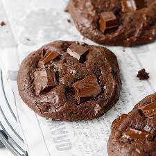
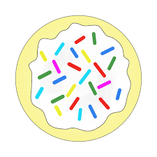
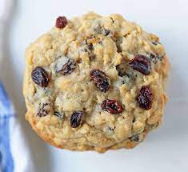
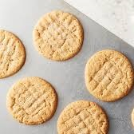
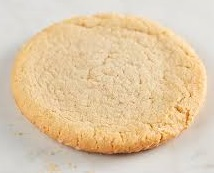
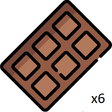
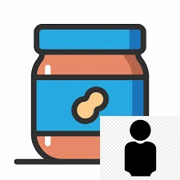
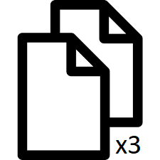
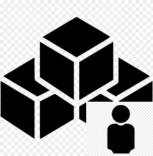
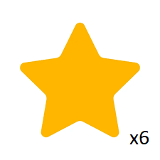

# Cookie Grab!

## What Is Cookie Grab?

This is a prototype for a card game.

Someone brought you cookies, and you and your friends all have specific tastes. The goal is to get the types of cookies that you want!

The game can be played either cooperatively, or competitively. This prototype assumes the competitive play mode.

## Cards

There are two types of cards - cookies and goals.

### Cookies

The following types of cookies are available in the game.

| Cookie Name             | Cookie Image                                        |
| ----------------------- | --------------------------------------------------- |
| Chocolate Chip          |            |
| Chocolate Fudge         |           |
| Creme Sandwich          |            |
| Frosted Sugar           |             |
| Holiday Tree            |              |
| Meringue                |                   |
| Oatmeal Raisin          |            |
| Peanut Butter Chocolate |  |
| Peanut Butter           |             |
| Sugar                   |              |

### Goals

The following goals are available in the game.

| Goal Name               | Goal Description                                             | Goal Image                                                |
| ----------------------- | ------------------------------------------------------------ | --------------------------------------------------------- |
| Chocolate Collector     | Collect 6 chocolate cookies                                  |       |
| Peanut Butter Collector | Collect peanut butter cookies equal to the number of players |  |
| Same Collector          | Collect 3 pairs of cookies                                   |            |
| Sugar Collector         | Collect sugar cookies equal to the number of players         |                   |
| Unique Collector        | Collect 6 unique cookies                                     |          |

The following types of cookies qualify for the collector goals:

- Chocolate Collector
  - Chocolate Chip
  - Chocolate Fudge
  - Creme Sandwich
  - Peanut Butter Chocolate
- Peanut Butter Collector
  - Peanut Butter Chocolate
  - Peanut Butter
- Sugar Collector
  - Frosted Sugar
  - Sugar

## Gameplay

At the beginning of the game, collect a number of each cookie equal to the number of players. Shuffle them together to form the deck. Deal the deck out face down into 4 piles in the middle of the gameplay area. Flip the top card face up when that is done.

Collect 2 of each goal card and shuffle them together to form the goal deck. Deal 2 goals to each player. In competitive mode, these goals are kept face-down and only the owner can see them. In cooperative mode, these goals are face-up.

Starting with the player who most recently ate a cookie in real life (please do not eat the cards!), select one of the face-up cookies in the center of the play area. Put the chosen cookie face down in your hoard. Be sure to choose one that will help you complete one of your goals, if possible! The next card from that pile is flipped face-up. Play continues clockwise, with players adding cookies to their hoards and flipping up the next card in that stack. If a stack is empty, you must choose from another stack. Each player must choose a cookie each round, even if only one pile remains.

The game ends when each player has 10 cookies and all piles are depleted.

At this point, the goals are turned face up (if in competitive mode). Each player scores 5 points for each completed goal. In cooperative mode, the combined score is calculated and play groups can benchmark against their best score!

## Run the Game Using Next.js

First time only:

```
npm install
```

To launch:

```
npm run dev
```

Navigate to `localhost:3000` in your favorite web browser.
